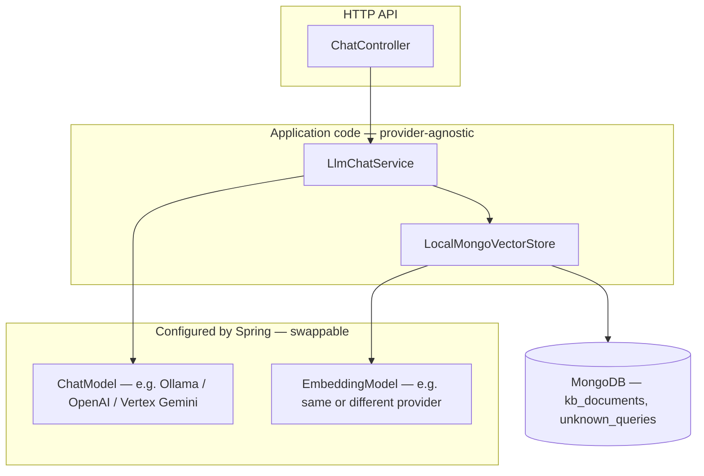

# rag-chat — Project overview (for team leads & project managers)

This document explains **what this service does**, **how it is built**, and **how we change the LLM (or embedding model) without rewriting application code**—so you can brief stakeholders and plan deployments.

---

## 1. What problem does it solve?

**rag-chat** is a **Spring Boot** HTTP API that powers:

| Capability | What the user gets |
|------------|-------------------|
| **Plain chat** | Answers using a general “government portal assistant” style (SSRP-themed prompts). |
| **RAG chat** | Answers using a **retrieved** slice of your **knowledge base** stored in **MongoDB**, so responses can be grounded in approved content. |

“RAG” = *retrieval-augmented generation*: we **search** for relevant text, then ask the LLM to answer **only** from that text.

---

## 2. Big-picture architecture (simple)

- **Business logic** (`LlmChatService`) depends only on Spring AI abstractions (**`ChatModel`**, **`VectorStore`**), not on “Ollama” or “OpenAI” APIs directly.
- **Which vendor runs** (local Ollama, OpenAI GPT, Google Vertex Gemini, …) is chosen in **configuration**, not by changing Java for each switch.

For deeper technical detail (packages, collections, endpoints), see **`ARCHITECTURE.md`**. For design trade-offs (local Mongo vs Atlas, patterns), see **`SPRING_AI_DESIGN.md`**.

---

## 3. How easy is it to change the LLM?

**Very easy at the code level:** the service always calls **`ChatModel`**. Switching provider is a **configuration and credentials** exercise.

### 3.1 Two knobs you care about

| Setting | Purpose |
|---------|---------|
| **`conf.ai.chat-provider`** | Which implementation powers **conversation** (answers). Values used in this project: **`ollama`**, **`openai`**, **`vertexai`**. |
| **`conf.ai.embedding-provider`** | Which model powers **vectors** for search + KB storage. Often kept on **Ollama** even when chat moves to GPT/Gemini, so you do **not** have to re-embed the whole KB until you intentionally change embedding model. |

These map to Spring Boot properties **`spring.ai.model.chat`** and **`spring.ai.model.embedding`**.

### 3.2 What you actually do when switching (no code rewrite)

1. **Ensure the right library is on the classpath** — already done in **`pom.xml`** (Ollama, OpenAI, Vertex Gemini starters under the Spring AI BOM).
2. **Set the provider** in YAML or activate a **profile** that sets it (e.g. **`openai`**, **`vertex-gemini`**).
3. **Provide secrets / endpoints** for that provider (API keys, GCP project, Ollama URL, etc.).
4. **If you change the embedding model**, plan **re-seeding or re-embedding** the knowledge base—same embedding space must be used for stored vectors and for query vectors.

### 3.3 Example profiles (already in the repo)

| Profile file | Typical use |
|--------------|-------------|
| **`application-dev.yml`** | Local development. |
| **`application-onsite.yml`** | On-premises / government network; env-driven Mongo/Ollama. |
| **`application-prod.yml`** | Production; Swagger off; quieter logs. |
| **`application-openai.yml`** | Adds **`openai`** — chat via OpenAI (e.g. GPT) when **`OPENAI_API_KEY`** is set. |
| **`application-vertex-gemini.yml`** | Adds **`vertex-gemini`** — chat via Vertex Gemini when GCP is configured. |

Activate multiple profiles, e.g. **`dev,openai`** or **`prod,vertex-gemini`**.

**Bottom line for leadership:** swapping LLM vendor is **operations and configuration**, not a **multi-sprint refactor**, as long as Spring AI supports that vendor and the team manages keys and network access.

---

## 4. Configuration model (why it stays maintainable)

- Central **`conf:`** block in **`application.yml`** holds app-wide defaults (Mongo, Ollama, OpenAI, Vertex, logging, Swagger).
- **`application-{profile}.yml`** files override **`conf`** per environment (dev / onsite / prod / optional LLM profiles).
- Maven can bake in a default Spring profile (`@activatedProperties@` in **`application.yml`**); runtime can override with **`--spring.profiles.active`**.

This keeps **one place** to understand “what is this environment running?” for audits and handovers.

---

## 5. Data & knowledge base

- **MongoDB** stores knowledge chunks in **`kb_documents`** (content + embeddings + metadata).
- **Startup seeding** (`KnowledgeBaseSeedRunner`) runs **only when** the KB is empty (and not in **`test`** profile), using **`VectorStore.add`** so embeddings are computed consistently.
- **Unknown questions** (when RAG finds no good match) can be logged to **`unknown_queries`** for operational review.

**MongoDB connection:** by default the URI is built from host/port/database. For **TLS** or full connection strings (e.g. Atlas-style), set **`MONGODB_URI`**.

---

## 6. APIs (for planning integrations)

Base path includes context path **`/ai-chat`** (see `conf.server.context-path`).

| Method | Path | Purpose |
|--------|------|---------|
| POST | `/ai-chat/chat` | Plain chat. |
| POST | `/ai-chat/chat/rag` | RAG chat. |

Swagger UI is available in dev when enabled (disabled in production profile by default).

---

## 7. Environment variables (typical for ops)

| Variable | Role |
|----------|------|
| `MONGO_HOST`, `MONGO_PORT`, `MONGO_DATABASE` | MongoDB location (when not using `MONGODB_URI`). |
| `MONGODB_URI` | Full TLS / SRV / replica-set URI when needed. |
| `OLLAMA_BASE_URL`, `OLLAMA_CHAT_MODEL`, `OLLAMA_EMBEDDING_MODEL` | Ollama deployment. |
| `OPENAI_API_KEY` | OpenAI when chat (or embeddings) use OpenAI. |
| `VERTEX_GCP_PROJECT_ID` | Google Vertex Gemini when using that profile. |

Never commit API keys; use secrets managers or env injection in deployment.

---

## 8. What remains “organizational” (not coded in this repo)

These are **deployment and policy** items your team should track separately:

- API **authentication** and **authorization** (gateway, API keys, OAuth2, mutual TLS, etc.).
- **Network egress** allowlists for cloud LLM APIs.
- **Backups** of MongoDB and procedures for **KB updates** / audit.
- **Logging** policy (e.g. whether full prompts may be logged).

---

## 9. Troubleshooting (short)

| Symptom | Things to check |
|---------|------------------|
| Two `ChatModel` beans / startup failure | Only one active provider per environment; profile and **`conf.ai.*`** aligned. |
| RAG quality drops after model change | **Embedding** model changed but KB not re-embedded; re-seed or migrate vectors. |
| `mvn` uses wrong Java | **`JAVA_HOME`** must point to **JDK 17** (matches `pom.xml`). |
| OpenAI on classpath but no key | Non-chat OpenAI features are excluded in `application.yml` so an empty key is OK when using Ollama only. |

---

## 10. Document map

| File | Audience |
|------|----------|
| **`PROJECT_OVERVIEW.md`** (this file) | Leadership, PM, onboarding—**product + ops + LLM swap**. |
| **`ARCHITECTURE.md`** | Engineers—**components, flow, REST, Mongo**. |
| **`SPRING_AI_DESIGN.md`** | Engineers—**design choices** (local Mongo, Spring AI patterns). |

---

*This overview replaces the phased implementation checklist; the codebase is implemented and described in the architecture and design docs above.*
